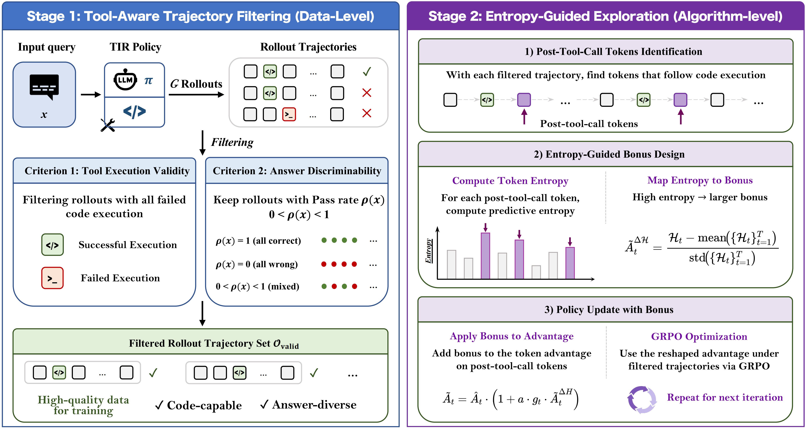
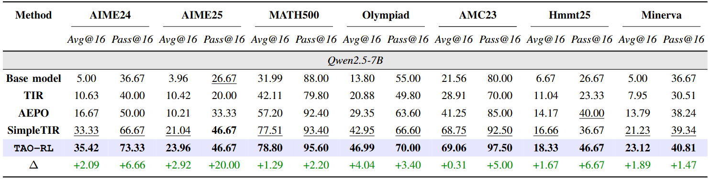

# **TAO-RL: Tool-Aware Optimization with Entropy Guidance for Efficient Agentic Reinforcement Learning**

This repository contains the official training and evaluation code for **TAO-RL**, an exploration-aware reinforcement learning framework designed to improve LLMs' agentic reasoning and tool-use capabilities.

## **💥 News**

- Coming soon.

## **👀 About TAO-RL**

Integrating external tools into Large Language Models (LLMs) substantially improves complex reasoning but often destabilizes RL training due to input distribution shifts and entropy collapse.

We present **TAO-RL**, a unified framework that couples **tool-aware trajectory filtering** with **entropy-guided exploration** for efficient policy optimization. At the data level, TAO-RL filters trajectories to prevent degenerate advantage estimates. At the algorithmic level, we introduce an entropy-guided bonus that reshapes the advantage function at post-tool-call tokens, encouraging the policy to explore more diverse reasoning paths and robust tool use.

<p align="center">
     <br>
    <em>Overview of the TAO-RL framework.</em>
</p>

This codebase is built upon the [VERL](https://github.com/volcengine/verl) reinforcement learning framework and utilizes the SimpleTIR (Simple Tool-Integrated Reasoning) paradigm with isolated Python sandboxing.

## **🔥 Quick Start**

### **1\. Environment Setup**

Please prepare the environment using Conda:

```bash
conda env create -f environment.yml
conda activate TAO-RL

# Install additional dependencies
pip install -r requirements.txt
pip install -e ".[vllm]"   # for vLLM-based rollout
```

### **2\. Download Checkpoints**

| Model | Repo ID            |
|:------|:-------------------|
| 1.5B  | Qwen/Qwen2.5-1.5B  |
| 4B    | Qwen/Qwen3-4B-Base |
| 7B    | Qwen/Qwen2.5-7B    |

You can download the base model using ModelScope:

```bash
# Install ModelScope if not already installed
pip install modelscope

# Download a model
modelscope download \
    --model Qwen/Qwen2.5-7B \
    --local_dir /path/to/models/Qwen/Qwen2.5-7B
```

## **🚀 Train & Eval Pipeline**

We provide a streamlined end-to-end workflow: **Sandbox ➔ Train ➔ Merge ➔ Evaluate**. All customizable scripts are located in the scripts/ directory.

### **Step 1: Start Sandbox Environment**

TAO-RL utilizes Firejail to provide an isolated and safe execution environment for the LLM's generated Python code. Ensure Firejail is installed (`sudo apt install firejail`), then start the sandbox service:

```bash
cd sandbox
bash run.sh
# The Uvicorn server will start on http://127.0.0.1:12345
```

### **Step 2: Launch Training**

Update the paths (e.g., `MODEL_PATH`, `DATA_PATH`) inside `scripts/example_train.sh` to point to your local directories. Then launch the training:

```bash
bash scripts/example_train.sh
```

*Note: Key hyperparameters such as `--entropy_coeff` can be directly configured in this script.*

### **Step 3: Merge Model Checkpoints**

After training completes, the FSDP sharded checkpoints need to be converted back into a standard Hugging Face format for evaluation. Update the step number and paths in `scripts/model_merger.sh`, then run:

```bash
bash scripts/model_merger.sh
```

### **Step 4: Evaluation**

We evaluate the models on comprehensive mathematical and reasoning benchmarks (e.g., AIME 2024/2025, AMC 23, MATH-500, OlympiadBench, Minerva). Set the `MODEL_PATH` in the test script to your merged model directory:

```bash
bash scripts/example_test.sh
```

## **📊 Benchmarks**

The TAO-RL framework has been rigorously evaluated on a comprehensive set of math reasoning benchmarks. Integrating our entropy guidance and tool-aware filtering yields state-of-the-art sample efficiency and reasoning accuracy across model scales from 1.5B to 7B parameters.

<p align="center">
     <br>
    <em>Experimental results on mathematical reasoning benchmarks.</em>
</p>

*(Detailed tabular results can be found in our paper).*

## **🤗 Acknowledgement**

This repository is built upon the [VERL](https://github.com/volcengine/verl) reinforcement learning framework and the [SimpleTIR](https://github.com/ML-GSAI/SimpleTIR) reasoning paradigm. We thank the authors for their valuable contributions to the open-source community.

## **✍️ Citation**

If you find our work or this code useful, please cite our paper:

```bibtex
@article{cao202Xtoolaware,
  title={Tool-Aware Optimization with Entropy Guidance for Efficient Agentic Reinforcement Learning},
  author={Cao, Hongye and Yan, Nuo and Deng, Haoyuan and Wang, Ziwei and Yang, Tianpei and Huo, Jing and Zhang, Yuyao and Gao, Yang},
  journal={Under Review},
  year={2026}
}
```  
